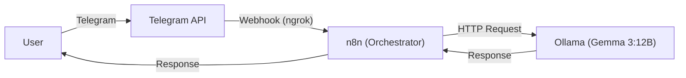

# 🤖 Privacy-First Local AI Assistant via Telegram
<div align="center">


[](https://n8n.io)
[](https://ollama.com)
[](https://www.docker.com/)
[](https://telegram.org)

**A fully local, privacy-focused AI assistant running on Docker, orchestrated by n8n, and accessible via Telegram.**
</div>

---

## 📖 About The Project

This project demonstrates how to build a **sovereign AI assistant** that runs entirely on your local machine. Unlike cloud-based solutions, **no data leaves your server**. 

It uses **Ollama** to run the **Gemma 3 (12b)** model locally and **n8n** to manage the logic flow between the user (Telegram) and the AI.

### 🌟 Key Features
* **🔒 100% Privacy:** All chat data stays on your local machine.
* **⚡ Local Inference:** Powered by Google's Gemma model via Ollama.
* **🤖 Smart Automation:** Workflow logic handled by n8n.
* **📱 Instant Access:** Accessible directly from Telegram Mobile/Desktop.
* **🐳 Dockerized:** Easy deployment with a single `docker-compose` file.

---

## 🏗️ Architecture


---

## 🛠️ Tech Stack

* **Orchestration:** [n8n](https://n8n.io) (Self-hosted)
* **AI Runner:** [Ollama](https://ollama.com)
* **LLM Model:** Gemma 3:12b (or Llama 3)
* **Interface:** Telegram Bot API
* **Deployment:** Docker & Docker Compose
* **Tunneling:** ngrok (for Webhook exposure)

---

## 🚀 Getting Started

Follow these steps to run the project on your local machine.

### Prerequisites
* Docker & Docker Compose installed
* Ollama installed and running (`ollama run gemma3:12b`)
* A Telegram Bot Token (via @BotFather)

### Installation

1.  **Clone the repository**
    ```bash
    git clone https://github.com/Mur-ti/Privacy-First-Local-AI-Assistant-via-Telegram.git
    cd Privacy-First-Local-AI-Assistant-via-Telegram
    ```

2.  **Configure Environment**
    Edit the `docker-compose.yml` file to include your ngrok URL or domain.

3.  **Run with Docker**
    ```bash
    docker compose up -d
    ```

4.  **Import Workflow**
    * Open n8n at `http://localhost:5678`
    * Create a new workflow
    * Import the `.json` file provided in this repo.
    * Add your **Telegram Credentials** and verify **Ollama Host** settings.

---

## 📸 Screenshots

<div align="center">
  
  <br>
  <em>Figure 1: n8n Workflow Logic</em>
</div>

---

## 🤝 Contact

**Murtaza** - [GitHub Profile](https://github.com/Mur-ti)

Project Link: [https://github.com/Mur-ti/Privacy-First-Local-AI-Assistant-via-Telegram](https://github.com/Mur-ti/Privacy-First-Local-AI-Assistant-via-Telegram)
